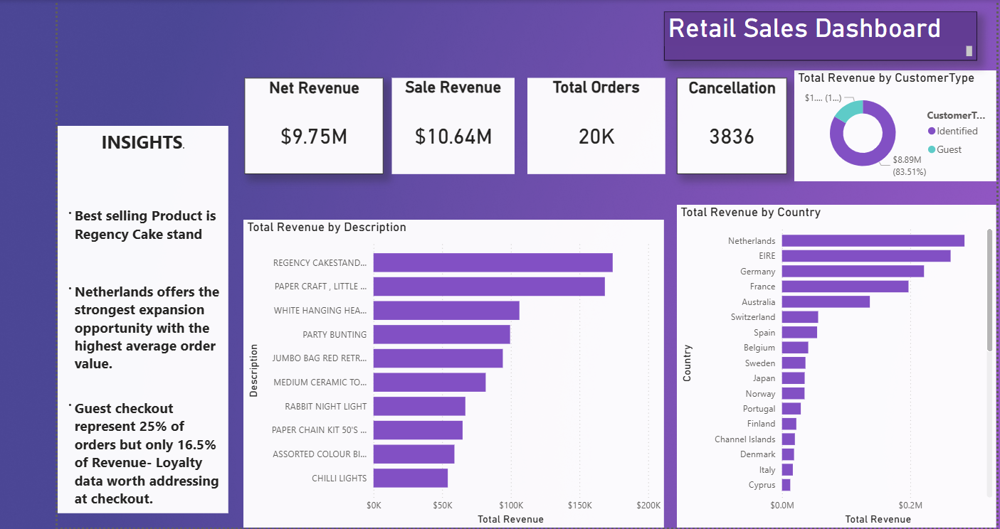
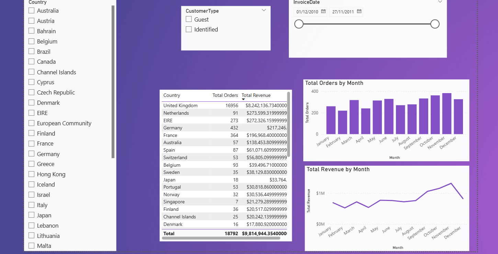

# UK Online Retail Analysis

**SQL cleaning, Excel validation and a Power BI dashboard on 534k UK online retail transactions (Dec 2010 – Dec 2011).**

---

## 1. Introduction

This project takes a raw transactional dataset from a UK-based online gift retailer and turns it into a clean, analysis-ready table and a two-page Power BI dashboard. It covers the full workflow: cleaning the data in SQL, cross-checking the results in Excel, and presenting the findings visually for decision-makers.

**Tools:** SQL (SQLite syntax), Excel, Power BI

## 2. Problem Statement

The raw data contains duplicates, rows without descriptions, stock adjustments recorded as zero-price sales, cancelled orders mixed in with real sales, and transactions without customer IDs. Reporting directly on it would overstate revenue and hide how the business actually performs.

This project answers:

1. How much revenue does the business really generate once returns and non-sales entries are handled?
2. Which products, countries and customer groups drive revenue?
3. When does demand peak, and how much does it depend on a small number of customers?
4. What should the business do differently as a result?

## 3. Data Sourcing

- **Dataset:** UCI Online Retail dataset (transactions from a UK-based online retailer).
- **Period:** 1 December 2010 – 9 December 2011.
- **Size:** 541,909 raw rows → **534,539 rows** after cleaning.
- **Fields:** InvoiceNo, StockCode, Description, Quantity, InvoiceDate, UnitPrice, CustomerID, Country.
- The cleaned file is in [`data/data_clean.zip`](data/data_clean.zip) (unzip to get `data_clean.csv`).

## 4. Data Transformation and Cleaning

All steps are in [`sql/cleaning_and_analysis.sql`](sql/cleaning_and_analysis.sql).

| Step | What was done | Why |
|---|---|---|
| Profile | Counted total rows and duplicate rows | Establish a baseline before changing anything |
| Remove duplicates | `SELECT DISTINCT` into a new `data_clean` table | Duplicate rows would double-count revenue |
| Missing descriptions | Dropped rows where `Description IS NULL` | These were mostly non-product or system entries |
| Trim text | `TRIM(Description)` | Stops the same product being counted as two |
| Customer type | Added `CustomerType`: **Guest** if no CustomerID, otherwise **Identified** | About a quarter of rows have no customer ID; they are kept, not deleted |
| Order type | Added `OrderType`: **Cancellation** if Quantity < 0, otherwise **Sale** | Separates returns from real sales |
| Zero/negative prices | Reviewed the distinct descriptions, then deleted rows with `UnitPrice <= 0` whose descriptions were adjustments, damages, samples, lost stock, marketplace entries, tests and similar | These are internal stock entries, not sales |
| Dates | Converted `InvoiceDate` into a sortable text date | Enables time analysis |
| Non-product lines | Excluded `POSTAGE`, `DOTCOM POSTAGE`, `CARRIAGE`, `Manual` and `AMAZON FEE` from product rankings | They are charges, not products |

**Excel cross-check:** [CONFIRM AND EDIT: describe what you checked, e.g. "A pivot table of Sales revenue by country matched the SQL country query to the penny"].

**Known limitations**

- 410 rows with a zero unit price remain. They have real product names and contribute £0 revenue.
- Guest rows have no customer ID, so they cannot be used in customer-level analysis.
- December 2011 is a partial month (data ends 9 December).

## 5. Measures

| Measure | Definition | Result |
|---|---|---|
| Sales Revenue | Sum of Quantity × UnitPrice where OrderType = Sale | **£10.64M** |
| Cancellations | Sum of Quantity × UnitPrice where OrderType = Cancellation | **−£0.89M** (8.4% of sales revenue) |
| Net Revenue | Sales Revenue + Cancellations | **£9.75M** |
| Orders | Distinct InvoiceNo on Sale rows | **19,970** |
| Average Order Value | Sales Revenue ÷ Orders | **£533** |
| Identified Customers | Distinct CustomerID | **4,339** |
| Guest Share of Revenue | Guest Sales Revenue ÷ Sales Revenue | **16.5%** |
| Repeat Customer Rate | Customers with more than one order ÷ Identified Customers | **65.6%** |

Example DAX (adjust to match your own model):

```DAX
Sales Revenue = CALCULATE(SUMX('data_clean', 'data_clean'[Quantity] * 'data_clean'[UnitPrice]), 'data_clean'[OrderType] = "Sale")
Orders = CALCULATE(DISTINCTCOUNT('data_clean'[InvoiceNo]), 'data_clean'[OrderType] = "Sale")
Average Order Value = DIVIDE([Sales Revenue], [Orders])
```

## 6. General Insights





**Revenue and customers**
- Sales revenue was **£10.64M** across **19,970 orders**. After cancellations, net revenue was **£9.75M**.
- **Identified customers generate 83.5% of sales revenue**, although guest checkouts account for about 25% of rows.
- The **top 20% of identified customers produce about 75% of identified revenue**. Two-thirds of customers ordered more than once.

**Geography**
- The **UK makes up 84.6%** of sales revenue.
- Outside the UK, the largest markets are the **Netherlands (£285k), EIRE (£283k), Germany (£229k), France (£210k) and Australia (£138k)**.
- The Netherlands and Australia have very high average order values (about £3,000 and £2,400 versus £533 overall), which suggests they buy in bulk rather than in many small orders.

**Seasonality and timing**
- Net revenue was around £0.5–0.7M a month from January to August 2011, then climbed to **£1.02M in September, £1.07M in October and £1.46M in November**, the peak of the year.
- Revenue is strongest on **Tuesdays and Thursdays**, there is **no trading on Saturdays**, and the busiest hours are mid-morning to early afternoon.

**Products**
- Top products by net revenue: **Regency Cakestand 3 Tier (£164k), White Hanging Heart T-Light Holder (£100k), Party Bunting (£98k), Jumbo Bag Red Retrospot (£92k)** and Rabbit Night Light (£67k).
- Two single orders, **80,995 units of "Paper Craft, Little Birdie"** and **74,215 units of "Medium Ceramic Top Storage Jar"**, were placed and cancelled in full. Ranking products on sales only makes them look like top sellers, so product rankings should use **net** figures.

## 7. Recommendations

1. **Plan inventory and staffing for September–November.** Demand roughly doubles in the autumn, so stock and delivery capacity should be in place before September.
2. **Convert guest shoppers into identified customers.** Offer an account, loyalty discount or email sign-up at checkout, because identified customers spend more and come back.
3. **Protect the top 20% of customers.** They generate about three-quarters of identified revenue, so account management and early access to new lines are worth the effort.
4. **Grow wholesale in high-value export markets.** The Netherlands, Australia and similar markets place large orders, so dedicated bulk pricing could grow them further.
5. **Add a check on very large orders.** Two single orders of around 75,000–81,000 units were reversed in full. An approval step above a quantity threshold would prevent errors and distorted reporting.
6. **Report product performance net of cancellations, and separately from postage and fees.** This gives a truer picture of what sells.

## 8. Conclusion

After cleaning, the business generated about **£9.75M in net revenue** from 4,339 identified customers across 38 countries. Its performance depends on three things: a strong autumn peak, a UK base that provides most of the revenue, and a small group of high-value customers. Protecting those customers, growing bulk export sales and preparing for September–November are the clearest ways to improve results. The data cleaning also shows why raw figures mislead: cancellations, fees and adjustments all distorted the headline numbers until they were separated out.

---

## Author

**Veronicah Tororei** · Cambridge, UK
